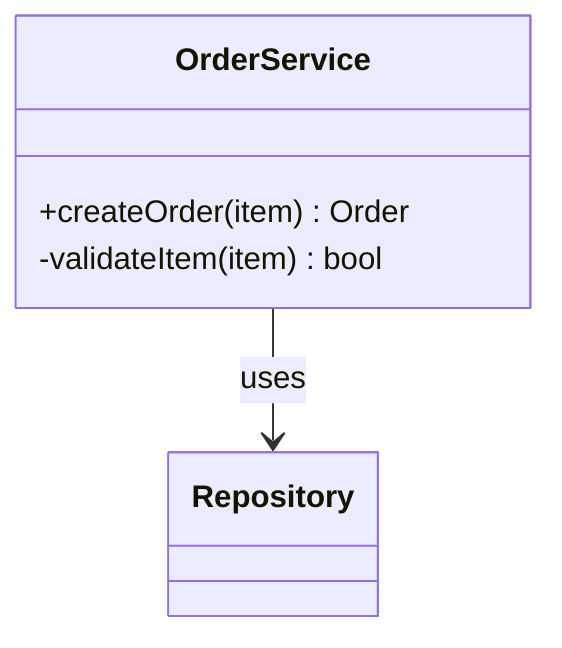
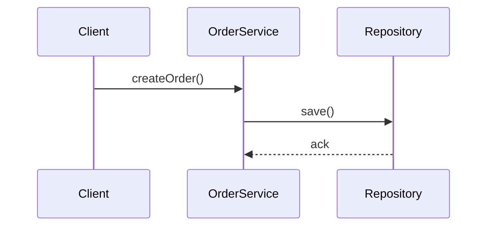

Here are effective prompt patterns for getting an LLM to generate UML content for a README.md.

## Core Approach: Use Mermaid (GitHub renders it natively)

Mermaid syntax renders directly in GitHub README.md as diagrams — no separate tool needed.

---

## Prompt Templates

### 1. From existing code

```
Analyze the following code and generate a complete README.md UML section 
using Mermaid syntax. Include:
- Class diagram (all classes, attributes, methods, relationships)
- Sequence diagram (main workflows/interactions)
- Component diagram (module dependencies)

Format each as a ```mermaid code block with a heading.
Code: <paste code here>
```

### 2. From a description

```
I'm designing a [system name] with these requirements:
[describe your system]

Generate a README.md UML section in Mermaid syntax covering:
1. Class diagram
2. Sequence diagram for [main use case]
3. State diagram (if stateful)

Use proper UML notation. Make it copy-paste ready for GitHub.
```

### 3. Comprehensive SW design doc prompt

```
Act as a software architect. Given this [code/description], generate a 
full UML design section for a README.md including:

## Architecture
- System context diagram (C4 model, mermaid)
- Component diagram

## Class Design  
- Class diagram with visibility modifiers (+/-/#)
- Inheritance and composition relationships

## Behavior
- Sequence diagram for the top 2 use cases
- Activity diagram for [specific flow]

Output only Mermaid code blocks with section headings. 
No explanation needed.
```

---

## Key Tips

| Tip                          | Why                                       |
| ---------------------------- | ----------------------------------------- |
| Specify `mermaid` explicitly | LLMs default to PlantUML otherwise        |
| Say "copy-paste ready"       | Suppresses prose explanation              |
| Name specific diagram types  | Vague requests get vague output           |
| Add "with all relationships" | LLMs omit edges when not prompted         |
| Provide actual code          | Output quality jumps vs. pure description |

---

## Example Output Shape

The prompt should yield blocks like:

~~~markdown
## UML Design

### Class Diagram


### Sequence Diagram

